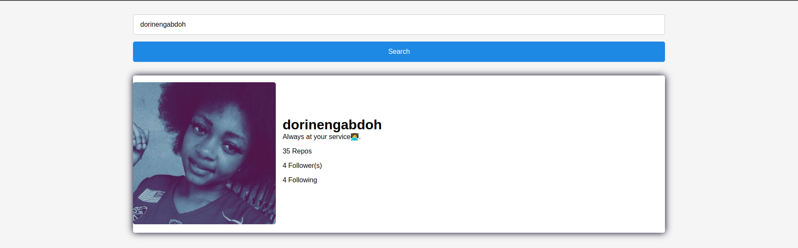

# github-profile-viewer

## App

## About

This is a simple github profile viewer app where Users are able to search for a name and see said profile. Users are also able to click on a profile and it takes them to the GitHub profile

## Build With

- Javascript
- HTML
- CSS
- Github API

### Prerequisites

Knowledge about JS:

- Asynchronous programming
- Promises
- Functions
- Fetch api

## Clone project

- To get a local copy up and running follow these simple example steps.
- Clone this repository with `https://github.com/abuemkezeChu/github-profile-viewer.git` using your terminal or command line.
- Change to the project directory by entering: cd github-profile-viewer in the terminal.

## Command line steps

- $ git clone `$ https://github.com/abuemkezeChu/github-profile-viewer.git`
- $ `cd github-profile-viewer`
- $ `git checkout feature

## Live Site

[Github Profile Viewer](https://abuemkezechu.github.io/github-profile-viewer/)

## Author

👤 **Abuemkeze Chu**

- GitHub: [@abuemkezeChu](https://github.com/abuemkezeChu)
- Twitter: [@abuemkeze](https://twitter.com/abuemkeze)
